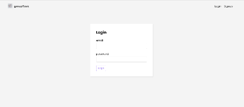
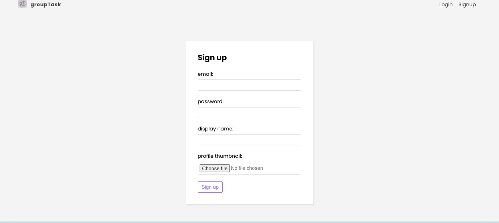
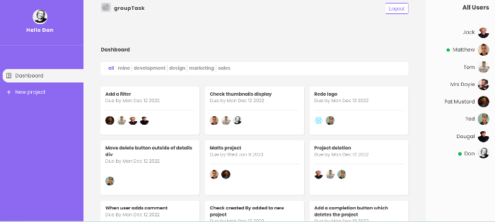
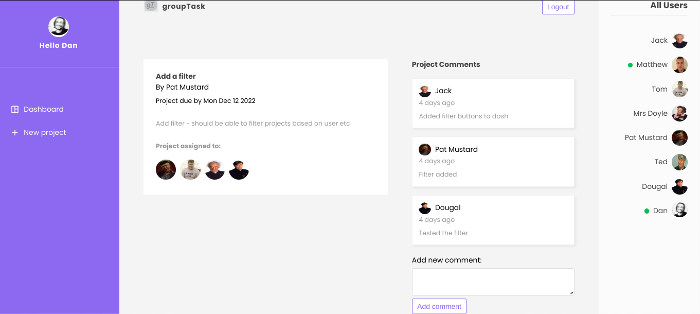

last build deployed on 14/12/2022 

current url: https://grouptaskapp-4eccd.web.app/
status (live)

Project: A project management app, using react and firebase. Users can sign up, log-in and create new project items. These projects can be 
assigned to other users. Users can comment on different projects. Visable projects can be displayed using different filters. The app lists all current
users in a panel and shows whether they are online or not. Tasks can be deleted / marked complete only by the user who created them.

Notes: 

started out with building the basic file and folder structure, I used hooks I had previously written in another project which handled similar crud application and interaction with firestore. From there I set up firebase and moved on to creating user authentication, again using hooks I had previously worked with. 

Users also upload a thumbnail when signing up, this taught me a bit about storage. Also displaying additional user information. I had not used photoURL before.

This project was a little more advanced, basically because users could do more than in previous applications I haave made. Each project item allows users to add comments and also the owner to markcomplete (delete). 

I found it very useful to actually check the data in firestore, if for example something wasn't working or I needed to check that the value for that user was correct. I found myself goinf back and forth between the code I was writing and the data stored in firebase to double check values, or here a property I needed for the code was in the user data. 

new users can only see a login or signup page initially, I used route guards and re-directs for this. 

 

Once a user is signed up / logged in, they can either view all current projects and use the filter the results displayed

users can post messages in each project, this acts almost like a chat system (something I may implement at a later date), I made use of date-fns, which I had not used before which displays when the user posted the message: 

As you can see, I did have fun when creating different users / avatars and usernames when testing the functionality. 

## Available Scripts

In the project directory, you can run:

### `npm start`

Runs the app in the development mode.\
Open [http://localhost:3000](http://localhost:3000) to view it in the browser.

The page will reload if you make edits.\
You will also see any lint errors in the console.

### `npm test`

Launches the test runner in the interactive watch mode.\
See the section about [running tests](https://facebook.github.io/create-react-app/docs/running-tests) for more information.

### `npm run build`

Builds the app for production to the `build` folder.\
It correctly bundles React in production mode and optimizes the build for the best performance.

The build is minified and the filenames include the hashes.\
Your app is ready to be deployed!

See the section about [deployment](https://facebook.github.io/create-react-app/docs/deployment) for more information.

### `npm run eject`

**Note: this is a one-way operation. Once you `eject`, you can’t go back!**

If you aren’t satisfied with the build tool and configuration choices, you can `eject` at any time. This command will remove the single build dependency from your project.

Instead, it will copy all the configuration files and the transitive dependencies (webpack, Babel, ESLint, etc) right into your project so you have full control over them. All of the commands except `eject` will still work, but they will point to the copied scripts so you can tweak them. At this point you’re on your own.

You don’t have to ever use `eject`. The curated feature set is suitable for small and middle deployments, and you shouldn’t feel obligated to use this feature. However we understand that this tool wouldn’t be useful if you couldn’t customize it when you are ready for it.

## Learn More

You can learn more in the [Create React App documentation](https://facebook.github.io/create-react-app/docs/getting-started).

To learn React, check out the [React documentation](https://reactjs.org/).

### Code Splitting

This section has moved here: [https://facebook.github.io/create-react-app/docs/code-splitting](https://facebook.github.io/create-react-app/docs/code-splitting)

### Analyzing the Bundle Size

This section has moved here: [https://facebook.github.io/create-react-app/docs/analyzing-the-bundle-size](https://facebook.github.io/create-react-app/docs/analyzing-the-bundle-size)

### Making a Progressive Web App

This section has moved here: [https://facebook.github.io/create-react-app/docs/making-a-progressive-web-app](https://facebook.github.io/create-react-app/docs/making-a-progressive-web-app)

### Advanced Configuration

This section has moved here: [https://facebook.github.io/create-react-app/docs/advanced-configuration](https://facebook.github.io/create-react-app/docs/advanced-configuration)

### Deployment

This section has moved here: [https://facebook.github.io/create-react-app/docs/deployment](https://facebook.github.io/create-react-app/docs/deployment)

### `npm run build` fails to minify

This section has moved here: [https://facebook.github.io/create-react-app/docs/troubleshooting#npm-run-build-fails-to-minify](https://facebook.github.io/create-react-app/docs/troubleshooting#npm-run-build-fails-to-minify)
